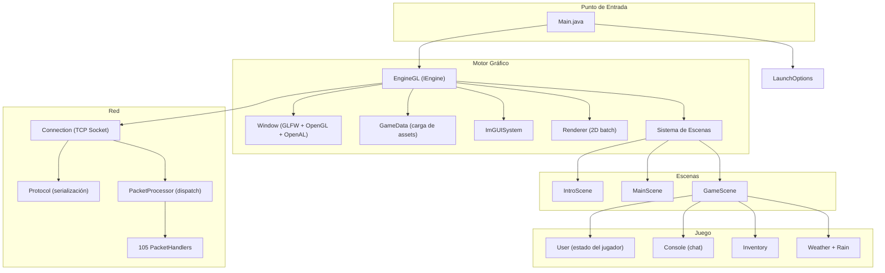
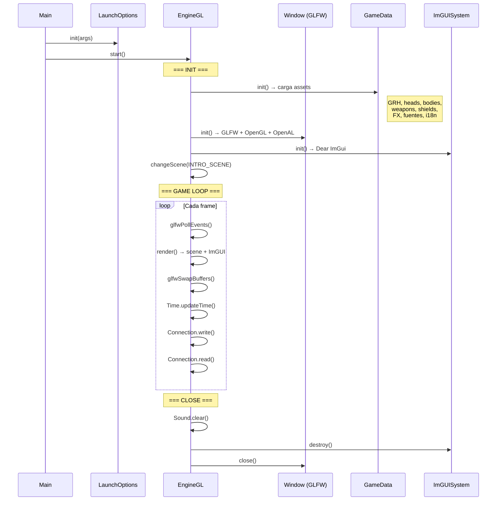
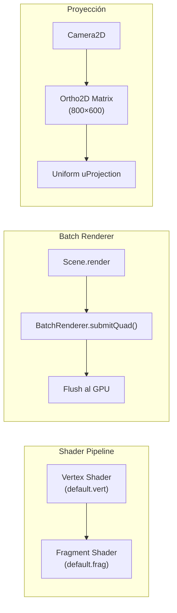
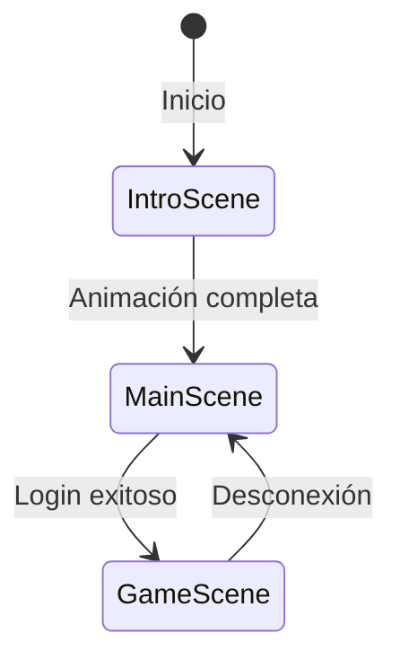
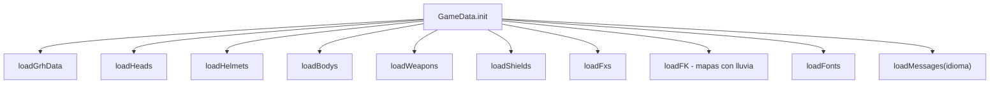
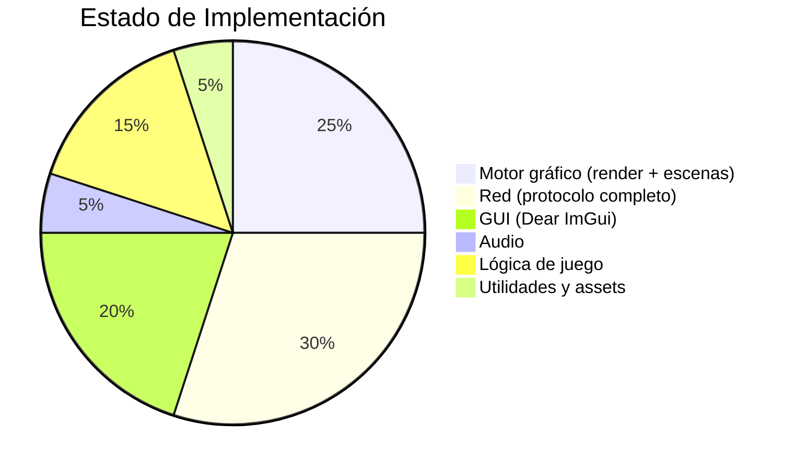

# 📖 Documentación Técnica — AO-Client

> **Análisis completo del cliente de Argentum Online en Java con LWJGL3**
> Fecha: 2026-05-05 · Generada automáticamente por análisis de código fuente

---

## 📌 Resumen General

**AO-Client** es la reimplementación del cliente del MMORPG *Argentum Online* en **Java 17** utilizando **LWJGL3** (Lightweight Java Game Library) para gráficos OpenGL 3.3, audio OpenAL, y gestión de ventanas GLFW.

El cliente está basado en un trabajo previo de *Lord Fers* (GS-Zone) que liberó un cliente offline base en LWJGL2, y ha sido significativamente ampliado y modernizado.

### Estadísticas del Proyecto

| Métrica | Valor |
|---------|-------|
| **Archivos Java** | 345 |
| **Paquete principal** | `org.aoclient` |
| **Build system** | Gradle + Shadow JAR |
| **Resolución** | 800×600 (fija) |
| **API gráfica** | OpenGL 3.3 |
| **API audio** | OpenAL 1.0 |
| **GUI Framework** | Dear ImGui |
| **Plataformas** | Windows, Linux, macOS (x64 + arm64) |

---

## 🏗️ Stack Tecnológico

| Componente | Tecnología | Versión |
|-----------|-----------|---------|
| **Lenguaje** | Java | 17 |
| **Build** | Gradle + Shadow JAR | 8.1.1 |
| **Gráficos** | LWJGL3 (OpenGL 3.3) | 3.3.3 |
| **Matemáticas** | JOML (Java OpenGL Math Library) | 1.10.5 |
| **GUI** | Dear ImGui (Java binding) | 1.86.11 |
| **Logging** | TinyLog | 2.7.0 |
| **Audio** | OpenAL (via LWJGL) | - |
| **Windowing** | GLFW (via LWJGL) | - |
| **CI/CD** | GitHub Actions | - |

### Dependencias LWJGL Incluidas

| Módulo | Propósito |
|--------|-----------|
| `lwjgl` | Core |
| `lwjgl-glfw` | Gestión de ventanas y input |
| `lwjgl-opengl` | Renderizado 2D |
| `lwjgl-openal` | Audio (música y efectos) |
| `lwjgl-stb` | Carga de imágenes (PNG) |
| `lwjgl-nanovg` | Vector graphics (futuro) |
| `lwjgl-vulkan` | API Vulkan (futuro, planificado) |
| `lwjgl-assimp` | Importación de modelos 3D (futuro) |
| `lwjgl-bgfx` | Backend gráfico alternativo |
| `lwjgl-nuklear` | UI alternativa |
| `lwjgl-par` | Procesamiento de mallas |

---

## 🎯 Arquitectura General



---

## 📂 Estructura de Paquetes

```
org.aoclient
├── Main.java                     ← Punto de entrada
│
├── engine/                       ← Motor del juego
│   ├── IEngine.java              ← Interfaz del motor
│   ├── EngineGL.java             ← Implementación OpenGL (activa)
│   ├── EngineVulkan.java         ← Implementación Vulkan (futuro)
│   │
│   ├── audio/                    ← Sistema de audio
│   │   ├── Sound.java            ← Gestor de música y efectos (OpenAL)
│   │   └── DecodedSoundData.java ← Datos de audio decodificados
│   │
│   ├── game/                     ← Lógica de juego
│   │   ├── User.java             ← Estado del jugador (singleton)
│   │   ├── Dialogs.java          ← Diálogos flotantes sobre personajes
│   │   ├── Messages.java         ← Sistema de mensajes i18n
│   │   ├── Options.java          ← Opciones del cliente
│   │   ├── Rain.java             ← Efecto de lluvia
│   │   ├── Weather.java          ← Sistema de clima
│   │   ├── IntervalTimer.java    ← Timer para cooldowns
│   │   │
│   │   ├── bindkeys/             ← Sistema de teclas configurables
│   │   │   └── actions/          ← 30+ acciones vinculables
│   │   │
│   │   ├── console/              ← Sistema de consola/chat
│   │   │
│   │   ├── inventory/            ← Sistema de inventario visual
│   │   │
│   │   └── models/               ← Modelos del juego
│   │       ├── Character.java    ← Modelo de personaje en pantalla
│   │       ├── City.java         ← Ciudades
│   │       ├── Direction.java    ← Direcciones (N/S/E/W)
│   │       ├── Position.java     ← Posición en el mundo
│   │       ├── Race.java         ← Razas del juego
│   │       ├── Skill.java        ← Habilidades
│   │       ├── Attribute.java    ← Atributos
│   │       ├── FontType.java     ← Tipos de fuente
│   │       ├── ObjectType.java   ← Tipos de objeto
│   │       ├── KillCounter.java  ← Contador de kills
│   │       └── Reputation.java   ← Sistema de reputación
│   │
│   ├── gui/                      ← Sistema de interfaz de usuario
│   │   ├── ImGUISystem.java      ← Integración Dear ImGui
│   │   ├── forms/                ← 20 formularios de interfaz
│   │   │   ├── Form.java         ← Base abstracta de formularios
│   │   │   ├── FConnect.java     ← Pantalla de conexión
│   │   │   ├── FCreateCharacter.java ← Creación de personaje
│   │   │   ├── FMain.java        ← HUD principal del juego
│   │   │   ├── FBank.java        ← Interfaz de banco
│   │   │   ├── FComerce.java     ← Interfaz de comercio
│   │   │   ├── FSkills.java      ← Panel de habilidades
│   │   │   ├── FStats.java       ← Panel de estadísticas
│   │   │   ├── FOptions.java     ← Opciones del juego
│   │   │   ├── FMapa.java        ← Mini-mapa
│   │   │   ├── FTutorial.java    ← Tutorial interactivo
│   │   │   └── gm/              ← Formularios de Game Master
│   │   │       └── tabs/        ← Pestañas del panel GM
│   │   └── widgets/              ← Widgets reutilizables
│   │
│   ├── listeners/                ← Handlers de input
│   │   ├── KeyHandler.java       ← Eventos de teclado
│   │   └── MouseListener.java    ← Eventos de ratón
│   │
│   ├── renderer/                 ← Pipeline de renderizado
│   │   ├── Renderer.java         ← Renderer principal
│   │   ├── BatchRenderer.java    ← Batch rendering optimizado
│   │   ├── Shader.java           ← Gestión de shaders GLSL
│   │   ├── Camera2D.java         ← Cámara 2D ortográfica
│   │   ├── Texture.java          ← Manejo de texturas OpenGL
│   │   ├── TextureManager.java   ← Cache de texturas con carga lazy
│   │   ├── FontRenderer.java     ← Renderizado de texto
│   │   ├── Drawn.java            ← Helpers de dibujo
│   │   ├── RGBColor.java         ← Color RGB
│   │   └── RGBAColor.java        ← Color RGBA
│   │
│   ├── scenes/                   ← Sistema de escenas
│   │   ├── Scene.java            ← Clase base abstracta
│   │   ├── SceneType.java        ← Enum (INTRO, MAIN, GAME)
│   │   ├── Camera.java           ← Cámara de escena
│   │   ├── IntroScene.java       ← Intro/splash screen
│   │   ├── MainScene.java        ← Menú principal (login)
│   │   └── GameScene.java        ← Escena de juego in-game
│   │
│   ├── utils/                    ← Utilidades
│   │   ├── GameData.java         ← Cargador central de assets
│   │   ├── BinaryDataReader.java ← Lector de datos binarios (LE)
│   │   ├── LaunchOptions.java    ← Opciones de línea de comandos
│   │   ├── Platform.java         ← Detección de SO
│   │   ├── Time.java             ← Gestión de delta time
│   │   ├── Log.java              ← Wrapper de logging
│   │   ├── inits/                ← Structs de datos de assets
│   │   │   ├── GrhData/GrhInfo   ← Datos de gráficos/animaciones
│   │   │   ├── BodyData          ← Datos de cuerpos
│   │   │   ├── HeadData          ← Datos de cabezas
│   │   │   ├── WeaponData        ← Datos de armas
│   │   │   ├── ShieldData        ← Datos de escudos
│   │   │   ├── FxData            ← Datos de FXs
│   │   │   └── MapData           ← Datos de mapa (tiles + capas)
│   │   └── tutorial/             ← Sistema de tutorial
│   │
│   └── window/
│       └── Window.java           ← Ventana GLFW (singleton)
│
├── network/                      ← Capa de red
│   ├── Connection.java           ← Conexión TCP socket (singleton)
│   ├── PacketBuffer.java         ← Buffer de bytes (Little-Endian)
│   ├── network-guide.md          ← Guía didáctica de networking (!)
│   └── protocol/
│       ├── Protocol.java         ← 130+ métodos de serialización
│       ├── ClientPacket.java     ← 129 paquetes cliente→servidor
│       ├── ServerPacket.java     ← 104 paquetes servidor→cliente
│       ├── PacketProcessor.java  ← Dispatch de paquetes entrantes
│       ├── types/                ← Enums de protocolo
│       │   ├── GMCommand.java    ← Comandos de Game Master
│       │   ├── MessageType.java  ← Tipos de mensaje
│       │   ├── NickColorType.java ← Colores de nick
│       │   ├── PlayerType.java   ← Tipos de jugador
│       │   └── CharacterEditType.java
│       ├── command/              ← Sistema de comandos de chat
│       │   ├── core/             ← Infraestructura de comandos
│       │   ├── execution/        ← Ejecutor de comandos
│       │   ├── metadata/         ← Metadatos de comandos
│       │   └── handlers/
│       │       ├── user/         ← Comandos de usuario (/online, /meditar...)
│       │       └── gm/          ← Comandos GM (/ban, /kick, /tp...)
│       └── handlers/             ← 105 handlers de paquetes servidor
│           ├── PacketHandler.java ← Interfaz base
│           ├── LoggedHandler, ChatOverHeadHandler...
│           ├── UpdateHPHandler, UpdateManaHandler...
│           ├── CharacterCreateHandler, ObjectCreateHandler...
│           └── gm/              ← Handlers GM específicos
│
└── scripts/
    └── Compressor.java           ← Descompresor de archivos .ao
```

---

## 🔄 Flujo de Ejecución



---

## 🎨 Pipeline de Renderizado

### Arquitectura del Renderer



- **Renderizado batch**: Agrupa quads con la misma textura para minimizar draw calls
- **Proyección ortográfica**: 800×600 para renderizado 2D
- **Shaders GLSL**: Vertex + Fragment shader mínimos
- **Texturas**: Carga lazy a través de `TextureManager` con procesamiento pendiente por frame

### Sistema de Mapas (4 capas)

| Capa | Propósito |
|------|-----------|
| Layer 1 | Terreno base (suelo) |
| Layer 2 | Decoraciones sobre el suelo |
| Layer 3 | Objetos (árboles, casas, etc.) |
| Layer 4 | Techo/overlay superior |

Cada mapa es de **100×100 tiles** con formato binario. Las texturas se precargan al cargar el mapa.

---

## 🌐 Sistema de Red

### Arquitectura

```mermaid
graph LR
    subgraph "Cliente"
        A[Protocol] -->|writeByte/writeString| B["outputBuffer<br/>(PacketBuffer)"]
        B -->|flush| C[Connection.write()]
        C -->|Socket TCP| D((Internet))

        D -->|Socket TCP| E[Connection.read()]
        E -->|bytes| F["inputBuffer<br/>(PacketBuffer)"]
        F --> G[PacketProcessor.process()]
        G -->|dispatch| H["105 Handlers"]
    end
```

### Conexión

- **Protocolo**: TCP sobre `java.net.Socket` (bloqueante)
- **Formato**: Binario, **Little-Endian** (compatibilidad VB6)
- **Codificación de strings**: CP-1252 (Windows-1252)
- **No-bloqueo**: Se usa `inputStream.available()` para no bloquear el game loop

### Protocolo Binario

Cada paquete comienza con **1 byte de ID**, seguido de datos estructurados:

```
┌──────────────┬────────────────────────┐
│ ID (1 byte)  │ Datos (N bytes)        │
└──────────────┴────────────────────────┘
```

### Paquetes

| Dirección | Cantidad | Ejemplos |
|-----------|----------|----------|
| **Cliente → Servidor** | 129 paquetes | Login, Walk, Attack, Talk, CastSpell, EquipItem, Commerce, Guild, Party, 70+ comandos GM... |
| **Servidor → Cliente** | 104 paquetes | Logged, CharacterCreate, ChangeMap, UpdateHP/Mana/Gold, ChatOverHead, ObjectCreate, PlayMIDI/Wave... |
| **Handlers implementados** | 105 | Uno por cada paquete del servidor |

### Compatibilidad

> [!IMPORTANT]
> El cliente está diseñado para ser **100% compatible** con el servidor VB6 original de Argentum Online (Alkon v13.0). Los IDs de paquetes y el formato binario deben coincidir exactamente.

---

## 🎮 Sistema de Escenas



| Escena | Descripción | Formularios ImGui |
|--------|-------------|-------------------|
| `IntroScene` | Splash screen con logo | - |
| `MainScene` | Menú de conexión/login | FConnect, FCreateCharacter |
| `GameScene` | Juego principal | FMain, FBank, FComerce, FSkills, FStats, FOptions, FMapa, FTutorial, FPanelGM... |

---

## 🖱️ Sistema de Input

### Teclado (Configurable)

Las teclas se configuran en `keys.properties` y soportan remapeo:

| Acción | Tecla predeterminada |
|--------|---------------------|
| Movimiento | WASD |
| Atacar | Ctrl izq |
| Hablar | Enter |
| Usar objeto | Espacio |
| Recoger objeto | Q |
| Equipar | E |
| Meditar | F6 |
| Lanzar hechizo | F7 |
| Trabajar | F8 |
| Opciones | F5 |
| Screenshot | F2 |
| Toggle música/sonido | M / F1 |
| Toggle nombres | N |
| Toggle FXs | F |
| Toggle safe mode | Numpad + |
| Salir | Escape |

### Ratón
- Click izquierdo: Interacción
- Doble click: Acción secundaria
- Scroll: (reservado)

---

## 📁 Sistema de Recursos

Los recursos del juego están comprimidos en archivos `.ao` personalizados y se descomprimen en runtime con `Compressor.java`:

| Archivo | Contenido | Tamaño |
|---------|-----------|--------|
| `graphics.ao` | Todos los sprites del juego | ~25 MB |
| `gui.ao` | Texturas de interfaz | ~18 MB |
| `inits.ao` | Datos de índices (GRH, heads, bodies, weapons, shields, FX, FK) | ~133 KB |
| `maps.ao` | Todos los mapas del juego | ~508 KB |

### Otros recursos

| Archivo/Directorio | Propósito |
|--------------------|-----------|
| `music/` | Archivos de música (OGG) |
| `sounds/` | Efectos de sonido |
| `fonts/` | Fuentes tipográficas |
| `shaders/` | Vertex + Fragment shaders GLSL |
| `strings_es.ini` / `strings_en.ini` | Internacionalización (español/inglés) |
| `options.ini` | Opciones del cliente |
| `keys.properties` | Mapeo de teclas |
| `Tutorial.dat` | Datos del tutorial |
| `icon.png` | Icono de ventana |
| `MAIN.png` / `CAST.png` | Cursores personalizados |

---

## 🔧 GameData: Carga de Assets

La clase `GameData` carga todos los recursos al inicio:



Todos los datos se leen desde archivos binarios con `BinaryDataReader` en formato **Little-Endian**, respetando el formato original de VB6.

---

## 🎵 Sistema de Audio

- **Motor**: OpenAL 1.0 via LWJGL
- **Música**: Archivos OGG reproducidos en streaming
- **Efectos**: Cargados bajo demanda
- **Fallback**: El cliente funciona sin audio si no hay dispositivo disponible
- **Control**: Toggle de música (M) y sonido (F1) configurable

---

## 🔄 CI/CD y Distribución

### GitHub Actions (`build_release.yml`)

| Trigger | Acción |
|---------|--------|
| Push a `main`/`master` | Build + Upload artifacts |
| Tag `v*` | Build + Create Release |

### Artefactos generados

1. **Shadow JAR** (`argentum-online.jar`) — JAR con todas las dependencias
2. **Portable App** (`ArgentumOnline-Portable.zip`) — Imagen portable con JRE embebido (vía `jpackage`)
3. **Instalador EXE** (`ArgentumOnline.exe`) — Instalador de Windows (opcional)

---

## 🎭 Patrones de Diseño Identificados

| Patrón | Uso |
|--------|-----|
| **Singleton (Enum)** | `Window.INSTANCE`, `Connection.INSTANCE`, `User.INSTANCE`, `ImGUISystem.INSTANCE`, `Options.INSTANCE` |
| **State** | Sistema de escenas (`Scene` → `IntroScene`/`MainScene`/`GameScene`) |
| **Strategy** | Múltiples implementaciones de `IEngine` (OpenGL/Vulkan) |
| **Observer/Callback** | GLFW callbacks para input (teclado, ratón) |
| **Batch/Flyweight** | `BatchRenderer` agrupa quads para minimizar draw calls |
| **Command** | Sistema de comandos de chat (handlers separados por comando) |
| **Handler/Chain** | `PacketProcessor` → `PacketHandler` para dispatching de paquetes |

---

## 📊 Estado de Madurez del Cliente



### ✅ Lo que FUNCIONA (muy avanzado)

- **Protocolo completo**: 129 paquetes de salida + 104 de entrada, 105 handlers
- **Motor gráfico**: Renderizado 2D con batch renderer y shaders GLSL
- **Sistema de escenas**: Intro → Main → Game con transiciones
- **GUI completa**: 20 formularios ImGui (login, creación de personaje, inventario, banco, comercio, skills, stats, opciones, mini-mapa, tutorial, panel GM)
- **Audio**: Música y efectos de sonido con OpenAL
- **Carga de assets**: Formato binario legacy completamente parseado
- **Sistema de comandos**: Todos los comandos de usuario y GM implementados
- **Internacionalización**: Español e inglés soportados
- **Input configurable**: Teclas remapeables vía archivo de configuración
- **Distribución**: CI/CD con JAR, portable y EXE
- **Compatibilidad**: Windows, Linux, macOS (x64 + arm64)

### ⚠️ En progreso / Pendiente

- **Motor Vulkan**: `EngineVulkan.java` existe pero no está implementado
- **NIO**: La conexión usa sockets bloqueantes (hay TODO para migrar a NIO)
- **Límite de paquetes**: El protocolo actual tiene un máximo teórico de 127 IDs (1 byte con signo)
- **mapInfo**: La carga de mapas menciona "Falta implementar el mapInfo"
- **Testing**: No hay tests unitarios en el cliente

### 🔴 Lo que FALTA (para ser un cliente completo)

- Vulkan como backend gráfico alternativo
- NIO o Netty para networking no bloqueante
- Tests unitarios
- Caché de mapas visitados
- Optimización de texturas (atlas de texturas)
- Sistema de partículas para efectos visuales

---

## 🆚 Comparación Cliente vs Servidor

| Característica | Cliente | Servidor |
|---------------|---------|----------|
| **Archivos Java** | 345 | 257 |
| **Build system** | Gradle | Maven |
| **Java** | 17 | 17 |
| **Paquetes de red** | 129 salida + 104 entrada | 7 entrada + 22 salida |
| **Tests** | 0 | 64 |
| **CI/CD** | ✅ Release builds | ✅ Tests + cobertura |
| **GUI** | Dear ImGui (20 forms) | - |
| **Networking** | Socket TCP directo | Netty NIO |
| **Madurez del protocolo** | ✅ Completo | ⚠️ ~10% |
| **Game loop** | ✅ Funcional | ❌ No implementado |
| **Estado general** | 🟢 Avanzado | 🟡 Fundamentos sólidos |

---

## 🔗 Referencias

- **LWJGL3**: https://www.lwjgl.org/
- **Dear ImGui (Java)**: https://github.com/SpaiR/imgui-java
- **JOML**: https://github.com/JOML-CI/JOML
- **Base original**: Lord Fers (GS-Zone) — Cliente offline LWJGL2
- **Servidor VB6 compatible**: [Alkon v13.0](https://www.gs-zone.org/temas/cliente-servidor-v0-13-0-completos-y-funcionales.36521/)
